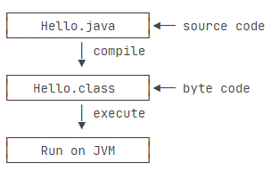

# `JAVA` Note:

## 1、`JAVA` 简介
> `Java` 介于编译型语言和解释型语言之间。  
  - 编译型：`C`、`C++`  
  - 解释型：`Python`、`Ruby`

> `Java` 版本：`EE` , `SE` , `ME` , 本教程针对 `Java 18`

> 学习路线：  
  1、首先要学习 `Java SE`，掌握 `Java` 语言本身、`Java` 核心开发技术以及 `Java` 标准库的使用；  
  2、如果继续学习 `Java EE`，那么 `Spring` 框架、数据库开发、分布式架构就是需要学习的；  
  3、如果要学习大数据开发，那么 `Hadoop`、`Spark`、`Flink`这些大数据平台就是需要学习的，他们都基于 `Java` 或 `Scala` 开发；  
  4、如果想要学习移动开发，那么就深入 `Android` 平台，掌握 `Android App` 开发。  

> 名词解释：  
  `JDK：Java Development Kit`   
  `JRE：Java Runtime Environment`  
  `JRE` 就是运行 `Java` 字节码的虚拟机。但是，如果只有 `Java` 源码，要编译成 `Java` 字节码，就需要 `JDK`，因为 `JDK` 除了包含 `JRE`，还提供了编译器、调试器等开发工具。   
  

> 第一个 `Java` 程序：  
  `Java` 规定，某个类定义的 `public static void main(String[] args)` 是 `Java` 程序的固定入口方法，因此， `Java` 程序总是从 `main` 方法开始执行。
  
  ```java
  public class Hello{
      public static void(String[] args){
          system.out.println("Hello world!");
      }
  }
  ```

> 运行 `Java` 程序：  
  `Java` 源码本质上是一个文本文件，需要先用 `javac` 把 `Hello.java` 编译成字节码文件 `Hello.class`，然后，用 `java` 命令执行这个字节码文件：  
  

> 小结：  
  1、一个 `Java` 源码只能定义一个 `public` 类型的 `class` ，并且 `class` 名称和文件名要完全一致；  
  2、使用 `javac` 可以将 `.java` 源码编译成 `.class` 字节码；  
  3、使用 `java` 可以运行一个已编译的 `Java` 程序，参数是类名。  

---

## 2、`JAVA` 基础

> `var` 关键字：  
  如果想省略变量类型，可以使用 `var` 关键字：  
```java
var sb = new StringBuilder(); // 等同于 StringBuilder sb = new StringBuilder();
```

> 语句块：  
  在 `Java` 中，多行语句用 `{ }` 括起来。很多控制语句，例如条件判断和循环，都以 `{ }` 作为它们自身的范围。

> 移位运算：  
```java
int n = 7;
int a = n << 1; // 14
int b = n >>> 1; // 无符号右移
```

> 位运算：
```java
n = 0 & 0;  // 与
m = 0 | 1; // 或
l = ~0; // 1 非
p = 0 ^ 0; // 异或
```

> 布尔运算：
  `&&` , `||` , `!` 为布尔与或非运算。

https://www.liaoxuefeng.com/wiki/1252599548343744/1255938912141568

---

## 3、流程控制

> 输出：  
  `println` 是 `print line` 的缩写，表示输出并换行。

> **格式化输出**：  
  占位符：`%d, %x, %f, %e, %s`
```java
double d = 3.1415926535
System.out.printf("%.2f\n", d); // 3.14
```

> 小结：  
  `Java` 提供的输出包括：`System.out.println()` / `print()` / `printf()`，其中 `printf()` 可以格式化输出；  
  `Java` 提供 `Scanner` 对象来方便输入，读取对应的类型可以使用：`scanner.nextLine()` / `nextInt()` / `nextDouble()` / ...

> **switch( ) { }** ：  
```java
public class Main() {
  public static void main(String[] args) {
    int option = 1;
    switch (option) {
    case 1:
        System.out.println("Selected 1");
        break;
    
    case 2:
        System.out.println("Selected 2");
        break;
      
    case 3:
    case 4:
        System.out.println("Selected 3");
        break;
    
    default:
        System.out.println("Not selected");
        break;
    }
  }
}
```

> 数组操作：  
```java
import java.util.*
    System.out.println(Arrays.toString(ns)); // ns is an array.
```

---

## 4、面向对象

> 参数传递：  
  1、基本类型参数的传递，是调用方值的复制。双方各自的后续修改，互不影响。  
  2、引用类型参数的传递，调用方的变量，和接收方的参数变量，指向的是同一个对象。双方任意一方对这个对象的修改，都会影响对方（因为指向同一个对象嘛）。  

> 构造方法：
  由于构造方法是如此特殊，所以构造方法的名称就是类名。构造方法的参数没有限制，在方法内部，也可以编写任意语句。但是，和普通方法相比，构造方法没有返回值（也没有 `void` ），调用构造方法，必须用 `new` 操作符。  

> 继承：  
```java
class Student extends Person {
    // 不要重复name和age字段/方法,
    // 只需要定义新增score字段/方法:

    private int score;
    
    public int getScore() {
        return this.score
    }

    public void setScore(int score) {
        if (score.equals(int)) && (0 <= score <= 100) {
            this.socre = score
        }
    }
}
```

> 继承的构造方法：  
  在 `Java` 中，任何 `class` 的构造方法，第一行语句必须是调用父类的构造方法。如果没有明确地调用父类的构造方法，编译器会帮我们自动加一句 `super();`

> 阻止继承：  
  `final` 类不能够被继承；  
  从 `Java 15` 开始，允许使用 `sealed` 修饰 `class` ，并通过 `permits` 明确写出能够从该 `class` 继承的子类名称。

> 向上转型、向下转型

> `instanceof` 对象的类型判断：
```java
if (p instanceof Student) {
    // do something
}
```
---
> ***多态***：  
  `@override`, `Override` 和 `Overload` 不同的是，如果方法签名不同，就是 `Overload`， `Overload` 方法是一个新方法；如果方法签名相同，并且返回值也相同，就是 `Override`。  
  `Java` 的实例方法调用是基于运行时的实际类型的动态调用，而非变量的声明类型。
---

> 抽象：  
  如果父类的方法本身不需要实现任何功能，仅仅是为了定义方法签名，目的是让子类去覆写它，那么，可以把父类的方法声明为抽象方法 `abstract`, 此时必须把类本身也声明为 `abstract`， 才能正确编译。 因为无法执行抽象方法，因此这个类也必须申明为抽象类 `（abstract class）`。