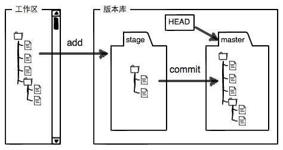
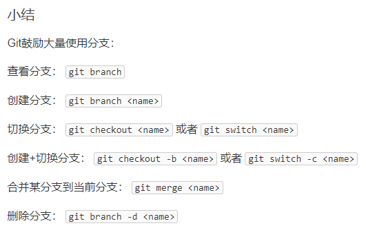

## SSH

ssh-keygen命令来自于英文词组“SSH key generate”的缩写，其功能是用于生成SSH密钥文件。ssh-keygen命令能够对SSH密钥文件进行生成、管理、转换等工作，支持RSA和DSA两种密钥格式。

常用参数：

| 参数名 | 作用 |
|  :-:  | :-:  |
| -b | 指定密钥长度 |
| -e | 读取已有私钥或者公钥文件 |
| -f | 指定用来保存密钥的文件名 |
| -t | 指定要创建的密钥类型 |
| -C | 添加注释 |

> ssh-keygen -t rsa -C "1170625468@qq.com"


## github

### 文件状态

- 已提交状态

> 当一个文件的所有修改都被保存在本地的` repo `中时，该文件就处于提交的 **`（committed）`** 状态。处于提交阶段的文件是可以被推送到远程` repo `（在` GitHub `上）的文件。

- 已修改状态

> 处于修改 **`（modified）`** 状态的文件已经做了一些修改，但还没有保存。这意味着该文件的状态与之前在提交状态下的状态有了改变。

- 暂存状态

> 处于暂存 **`（staged）`** 状态的文件意味着它可以被提交了。在这种状态下，所有必要的修改都已经完成，所以下一步就是把文件移到提交状态。

### 相关命令及操作

- **安装 Git**

[**安装官方网站**](https://git-scm.com/downloads)

安装完后验证：

在terminal输入命令：```git --version```

- **配置Git**

你需要做的是设置你的用户名和电子邮件地址。Git 会使用这些信息来识别谁对文件进行了修改。

设置用户名：

```git config --global user.name "your name"```

设置邮箱：

```git config --global user.mail "your mail"```

- **在Git中创建项目并进行初始化**

1、创建项目文件夹  
2、进入项目文件夹位置，cd desktop ......  
3、初始化，输入命令 ```git init``` 。现在 `Git` 开始监视你的项目文件的变化  
4、在文件夹中开始你的项目  
5、推送你的本地repo到Github：  
> **5.1 在 Git 中添加文件**  
> 输入命令 ```git add .``` 或者添加指定文件 ```git add todo.txt```  
> **5.2 在 Git 中提交文件**  
> 输入命令 ```git commit -m "your acting info"```  
> **5.3 在 Git 中推送文件**  
> 1、建立连接，```git remote add origin "...... .git"```  
> 2、将主分支命名为 main ，```git branch -M main```  
> 3、推送文件，```git push -u origin main```

- **在Git中的其余操作**

查看文件状态： ```git status```  
创建新分支 test ：```git checkout -b test```  
查看分支：```git branch```  
切换回主分支：```git checkout main```
合并分支：```git merge test```  
拉取仓库：  
> 1、```cd ...```  
> 2、```git clone YOUR_HTTPS_URL```  

## **`Git` 教程 - New**

> - 版本回退：  
  首先，`Git` 必须先知道当前版本是哪个版本，使用 `git log ` 可以查看各个版本。  
  在 `Git` 中， 用 `HEAD` 表示当前版本， `HEAD^` 表示上一个版本， `HEAD^^` 表示上上个版本， 当然往上100个版本可以用 `HEAD~100` 表示。  
  **注意:** `HEAD^` 有时候会被识别为还有下一行信息输入， 可以直接使用 `HEAD~1` 表示。
  ```
  git reset --hard HEAD~1
  git reset --hard 06bcf
  git reflog
  ```

> - 工作区和暂存区：  
  工作区就是在电脑里能看到的目录
  `.git` 文件是 `Git` 的版本库。`Git` 的版本库里存了很多东西，其中最重要的就是称为 `stage`（或者叫 `index`）的暂存区，还有 `Git` 为我们自动创建的第一个分支 `master`，以及指向 `master` 的一个指针叫`HEAD`。
  

> - 撤销修改：  
  **场景1**：当你改乱了工作区某个文件的内容，想直接丢弃工作区的修改时，用命令 `git checkout -- file` ( for Linux and Macos ) 、`git restore -- file` ( for Windows ) 。  
  **场景2**：当你不但改乱了工作区某个文件的内容，还添加到了暂存区时，想丢弃修改，分两步，第一步用命令 `git reset HEAD <file>`，就回到了场景1，第二步按场景1操作。  
  **场景3**：已经提交了不合适的修改到版本库时，想要撤销本次提交，参考版本回退一节，不过前提是没有推送到远程库。

---

- 远程仓库：  

1、添加远程库：  
创建 `github` 账户， 并在上面新建一个库 `create a new repository` ，根据 `github` 提示， 关联本地仓库：  
```
git remote add origin git@github.com:tanqinglin/test.git  # 关联
git push -u origin master
```

2、从远程仓库中克隆：
```
git clone git@github.com:tanqinglin/test.git # 从远程仓库克隆到本地
```
  
---

- 分支管理：

1、创建新分支：

```
git checkout -b dev # 创建一个新的分支名为 dev
git add file
git commit -m "add a new file"

git checkout master # 切换回主分支，查看刚才修改的内容，发现没有任何关于刚才修改的信息，因为刚才的修改是在 dev 分支内进行的，主分支看不见
```

2、融合分支：
```
git merge dev # 融合dev分支的内容到master。
git branch -d dev # 删除分支 dev
git switch -c dev # 创建并切换到分支 dev
git switch dev # 已经存在分支，不需要创建，直接切换
```

3、小结：  



